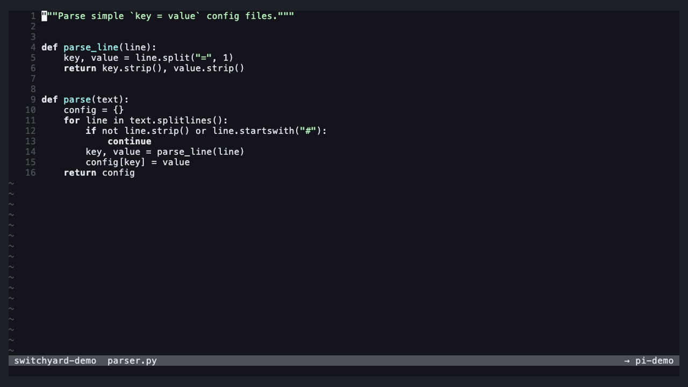

# switchyard.nvim

**Agents running on worktrees, and an editor that follows them.**

switchyard is a Neovim plugin for working with several AI coding agents at
once, each in its own git worktree. It gives you one small screen to switch
between worktrees and agents, a terminal split to talk to an agent, a prompt
builder that sends code from your editor, and an editor that keeps up with
what the agent is doing.


<sub>The demos use a terminal with `<Space>` as leader; switchyard sets no keys
itself (see [Keymaps](#keymaps)).</sub>

## Why

Running agents in parallel works best when every agent has its own checkout
of the repo: a git **worktree** per task. That quickly means juggling
worktrees, terminal sessions and editor state by hand. switchyard keeps them
together:

- **Tracks** are git worktrees, managed through [worktrunk](https://worktrunk.dev).
- **Trains** are agent sessions, each running in its own tmux session.
- **The yard** is one screen in Neovim to switch worktrees and manage agents.
- Your editor is **linked** to one agent: prompts go there, and when that agent
  moves to another worktree, the editor follows.

## Features

- **The yard**: a small floating window with two views, *worktrees* and
  *agents*. Switch, peek, create and remove worktrees, start, fork, rename and
  stop agents, all with single keys and a `.` action menu.
- **Linking and following**: arriving in a worktree links its agent
  automatically; if the linked agent moves, the editor follows.
- **Peek**: visit another worktree to copy something, while prompts keep going
  to the agent you were working with.
- **Viewer**: the agent's terminal in a split next to your code, or in an
  external terminal window.
- **Prompt builder**: write a prompt in a floating input, add code selections,
  diagnostics or whole files as context, and send it to any agent, or paste it
  into the agent's own input to finish there.
- **Dispatch**: hand a task to a *new* agent in a *new* worktree, without
  leaving what you're doing.
- **Live reload**: open files reload while the agent edits them, even while
  you're typing in the agent's terminal.
- **Follow edits**: optionally open whatever file the agent just changed,
  with the cursor on the change.

## Requirements

- **Neovim 0.12+**
- **git**
- **[worktrunk](https://worktrunk.dev)** (`wt`) for worktrees:
  `brew install worktrunk && wt config shell install`
- **tmux**: agents run in tmux sessions, so switchyard can show them in a
  split and they keep running when Neovim closes
- **An agent**: today that's [pi](https://pi.dev) with the
  [pi-nvim](https://github.com/carderne/pi-nvim) extension
  (`pi install npm:pi-nvim`), which lets switchyard find running sessions and
  send them prompts. Claude Code support is planned.

No other Neovim plugins are needed. Run `:checkhealth switchyard` to see
what's found.

## Installation

With the built-in plugin manager (`vim.pack`, Neovim 0.12):

```lua
vim.pack.add({ "https://github.com/Luyste/switchyard" })
require("switchyard").setup({})
```

With [lazy.nvim](https://github.com/folke/lazy.nvim):

```lua
{
  "Luyste/switchyard",
  config = function()
    require("switchyard").setup({})
  end,
}
```

## Keymaps

switchyard sets **no global keymaps**. It gives you functions to map. A
starting point:

```lua
local function sy(name)
  return function()
    require("switchyard")[name]()
  end
end
local map = vim.keymap.set

map({ "n", "t" }, "<leader>yy", sy("open_yard"), { desc = "switchyard: the yard" })
map({ "n", "t" }, "<leader>yv", sy("toggle_view"), { desc = "switchyard: show/hide the agent" })
map({ "n", "t" }, "<leader>yj", sy("focus_view"), { desc = "switchyard: jump between agent and editor" })
map({ "n", "x" }, "<leader>yp", sy("prompt"), { desc = "switchyard: prompt (+ selection)" })
map("n", "<leader>yl", sy("prompt_line"), { desc = "switchyard: prompt with this line + diagnostics" })
map({ "n", "x" }, "<leader>yd", sy("dispatch"), { desc = "switchyard: dispatch a task" })
map({ "n", "t" }, "<leader>yh", sy("link_here"), { desc = "switchyard: link an agent in this worktree" })
map({ "n", "t" }, "<leader>yf", sy("follow_edits"), { desc = "switchyard: follow the agent's edits" })
map("n", "<leader>yo", sy("open_external"), { desc = "switchyard: agent in an external terminal" })
```

`<leader>` doesn't work in terminal mode (you'd type it to the agent), so for
the `"t"` mappings pick keys that don't reach the agent. In
[Neovide](https://neovide.dev) the Cmd key works well: `<D-y>`, `<D-j>`,
`<D-J>` and so on.

The function form (`sy("open_yard")`) keeps your config from breaking if a
name ever changes.

## Using it

### The yard

Open it with `open_yard()` or `:Switchyard`. It opens on the current
worktree (or the linked agent in the agents view) in normal mode.

| Key | Worktrees view | Agents view |
| --- | --- | --- |
| `Enter`, `1`–`9` | switch the editor there | go to: switch to its worktree and link it |
| `Shift+Enter` | peek: switch, keep the current link | link it, stay where you are |
| `Tab` | agents view | worktrees view |
| `n` | worktree for a branch (new, or an existing one) | new agent in a worktree |
| `N` | dispatch a task | dispatch a task |
| `D` | remove worktree (choose: keep or stop its agents) | stop the agent |
| `f` | fork the linked agent into this worktree | fork this agent into another (or a new) worktree |
| `a` / `c` | start a new agent / continue the last session here | |
| `y` | copy the path | |
| `d` | its changes against the default branch (needs a diff viewer, see `diff`) | the changes in its worktree |
| `v` / `g` | | show it in the split / in an external terminal |
| `s` | | write a prompt for this agent |
| `r` | | rename its tmux session |
| `/` | filter | filter |
| `.` / `?` | actions for this row / all keys | same |
| `Ctrl-R`, `q` | refresh, close | same |

Every key can be changed in `keys.yard` (see Configuration).

The yard shows **one project**: the worktrees and agents of the repo you're
in. For another repo, open Neovim there.

### Linking, following and peeking

Your editor is linked to one agent. The link decides where prompts go and
which agent the editor follows. Arriving in a worktree:

- **one agent there**: the editor links to it, silently;
- **several agents**: the one you viewed last, else the most recently started
  (unless you're already linked to one of them);
- **no agent**: the link stays (configurable with `empty_worktree`).

When the linked agent moves to another worktree, the editor switches there.
Switching the editor yourself never moves an agent.

**Peek** (`Shift+Enter` in the yard) switches without touching the link: look
around in worktree B, copy a snippet, and send it to your agent in A. Changed
your mind? `link_here()` links an agent of the worktree you're in.

### The viewer

`toggle_view()` shows the linked agent's terminal in a split on the right
(or another agent of this worktree), and hides it again. `focus_view()` jumps
between the agent and your code without leaving terminal mode by hand. The
bar on top shows which agents you can see here, with `●` on the linked one.

The viewer is for typing to the agent. Choosing *which* agent to see happens
in the yard (`v` in the agents view).

`open_external()` opens the linked agent in a new terminal window instead
(Ghostty, kitty, WezTerm, Alacritty or Terminal.app, or your own command).

### The prompt builder


`prompt()` opens a small input for a prompt to the linked agent. In visual
mode, the selection is added as **context** first. The draft is kept when the
builder closes (it disappears as soon as you click elsewhere), so you can
collect several pieces of code before sending.

| Key | Action |
| --- | --- |
| `Enter` | send |
| `Shift+Enter`, `Ctrl-J` | new line |
| `Ctrl-F` | add the file you came from (as a path) |
| `Ctrl-D` | remove a context |
| `Ctrl-T` | send this prompt to another agent, or dispatch it |
| `Ctrl-O` | hand over: paste into the agent's own input, without sending, and show it |
| `Esc`, then `q` | close (the draft stays) |
| `Ctrl-X` (normal mode) | clear the draft |

`prompt_line()` adds the current line with its diagnostics. The agent
receives your text followed by each piece of context as a fenced code block
with its path and line numbers. Paths are relative to the agent's worktree
when the file is in it, and absolute otherwise, so an agent in another
worktree never edits the wrong checkout.

### Dispatch


`dispatch()` (or `N` in the yard) opens the prompt builder aimed at a new
worktree. Write the task and press `Enter`: switchyard suggests a branch name
from the first line, creates the worktree, and starts an agent there with
your text as its first message. Your editor and your link stay where they
are; the new agent shows up in the yard.

### Checking an agent's changes

`d` on a worktree (or an agent) in the yard shows that worktree's changes
against the repo's default branch, including what the agent hasn't committed
yet, without switching your editor there. It uses
[codediff.nvim](https://github.com/esmuellert/codediff.nvim) when installed
(`:CodeDiff --repo <worktree> <default branch>`); with another diff plugin,
set `diff` to a function that opens it. Without either, `d` isn't offered.

### Live reload and following edits



With `live_reload` on (the default), files open in Neovim reload when an agent
changes them, also while you're typing in the viewer. Buffers with unsaved
changes are never touched.

`follow_edits()` turns on **following edits**: whenever the agent changes a
file in your worktree, it opens in your editor window with the cursor on the
change, without taking focus from the viewer. Ignored files (`.gitignore`)
are skipped. This needs recursive file watching, which Neovim offers on macOS
and Windows.

### Statusline

Three cheap functions (no file access) for your statusline:

```lua
require("switchyard").status()          -- "pi-shoebox" or "pi-shoebox (in other-worktree)"
require("switchyard").following_edits() -- true while following edits
require("switchyard").draft_status()    -- "DRAFT 2" while a prompt draft waits
```

## Configuration

The defaults:

```lua
require("switchyard").setup({
  agents = { "pi" },           -- agent adapters to use, when installed
  follow = true,               -- follow the linked agent to other worktrees
  empty_worktree = "keep",     -- arriving where no agent runs: "keep" | "unlink" the link
  terminal = "auto",           -- external terminal: "auto" | "ghostty" | "kitty" | "wezterm"
                               --   | "alacritty" | "terminal.app" | function(cmd) return argv end
  live_reload = true,          -- reload open files when agents change them
  diff = "auto",               -- d in the yard: "auto" (codediff.nvim when installed) | "codediff"
                               --   | false | function(worktree) with worktree = { path, branch, base }
  yard = {
    view = "worktrees",        -- the view the yard opens in: "worktrees" | "agents"
  },
  viewer = {
    width = 0.45,              -- share of the editor width for the viewer split
  },
  keys = {
    yard = {
      activate = "<CR>", alt_activate = "<S-CR>", toggle_view = "<Tab>",
      filter = "/", refresh = "<C-r>", close = "q", actions = ".", help = "?",
      new = "n", remove = "D", fork = "f", dispatch = "N",
      start_agent = "a", continue_agent = "c", copy_path = "y", diff = "d",
      view = "v", external = "g", rename = "r", send = "s",
    },
  },
})
```

## Commands and events

- `:Switchyard` opens the yard; `:Switchyard follow-edits` toggles following
  edits.
- `User SwitchyardSwitched` fires after the editor switched worktrees
  (`data = { from, to }`), for example to reopen a file tree:

  ```lua
  vim.api.nvim_create_autocmd("User", {
    pattern = "SwitchyardSwitched",
    callback = function()
      require("nvim-tree.api").tree.open()
      vim.cmd.wincmd("p")
    end,
  })
  ```

- `User SwitchyardSessionsChanged` fires when agents start, stop or move, and
  `User SwitchyardLinkChanged` when the link changes.

## Status

switchyard is young and used daily with pi. Planned: Claude Code support,
showing whether an agent is working or waiting for you, and choosing the base
branch for dispatch.

## Development

Tests run headless: `for t in tests/*.lua; do nvim --headless -u NONE --cmd "set rtp+=." -l $t; done`.
The demo GIFs are recorded with [vhs](https://github.com/charmbracelet/vhs):
`demo/record.sh` builds a demo repo with agents (needs pi with pi-nvim) and
records every `demo/*.tape`.

## License

[MIT](LICENSE)
