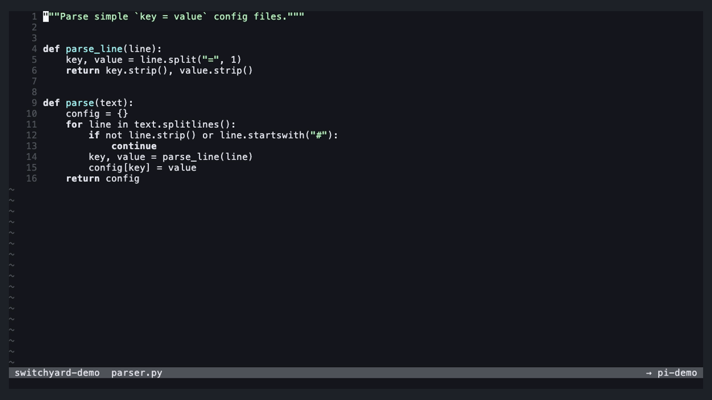
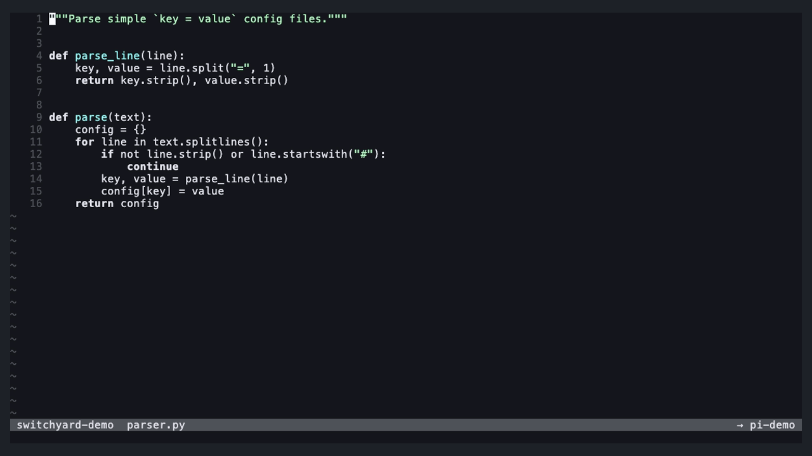

# switchyard.nvim

**Agents running on worktrees, and an editor that follows them.**

switchyard is a Neovim plugin for working with several AI coding agents at
once, each in its own git worktree. It gives you one picker to switch between
worktrees, agents and projects, a terminal split to talk to an agent, a prompt
builder that sends code from your editor, and an editor that keeps up with
what the agent is doing.

<sub>The demos below use a terminal with `<Space>` as leader; switchyard sets
no keys itself (see [Keymaps](#keymaps)). They were recorded before the yard
got its projects view and fuzzy filter.</sub>

## Why

Running agents in parallel works best when every agent has its own checkout
of the repo: a git **worktree** per task. That quickly means juggling
worktrees, terminal sessions and editor state by hand. switchyard keeps them
together:

- **Tracks** are git worktrees.
- **Trains** are agent sessions (pi, Claude Code, codex, or any CLI agent),
  each running in its own tmux session.
- **The yard** is one picker in Neovim to switch worktrees and projects and
  manage agents.
- Your editor is **linked** to one agent: prompts go there, and when that agent
  moves to another worktree, the editor follows.

## Features

- **The yard**: a small floating window with three views: *worktrees*,
  *agents* and *projects* (any git repo on your machine, plus pinned folders).
  Switch, peek, create and remove worktrees, start, fork, rename and stop
  agents, all with single keys and a `.` action menu; `/` filters fuzzily.
- **Linking and following**: the editor goes with the agent of where it is:
  arriving in a folder links its agent and shows it in the viewer; if the
  linked agent moves, the editor follows.
- **Peek**: visit another worktree to copy something, while prompts keep going
  to the agent you were working with.
- **Viewer**: the agent's terminal in a split next to your code, or in an
  external terminal window.
- **Prompt builder**: write a prompt in a floating input, add code selections,
  diagnostics or whole files as context, and send it to any agent, or paste it
  into the agent's own input to finish there.
- **Dispatch**: hand a task to a *new* agent in a *new* worktree, without
  leaving what you're doing.
- **Live reload**: open files reload while the agent edits them, even while
  you're typing in the agent's terminal.

## Requirements

- **Neovim 0.12+**
- **git**: worktrees are plain `git worktree`s
- **tmux**: agents run in tmux sessions, so switchyard can find them, show
  them in a split and type prompts into them, and they keep running when
  Neovim closes
- **An agent CLI**: [pi](https://pi.dev),
  [Claude Code](https://claude.com/claude-code) and
  [codex](https://github.com/openai/codex) work out of the box; any other
  CLI agent can be added in `agents` (see [Agents](#agents)). No agent
  extensions are needed.

- **fd**: finds the projects (the yard's projects view)

Run `:checkhealth switchyard` to see what's found.

## Installation

With the built-in plugin manager (`vim.pack`, Neovim 0.12):

```lua
vim.pack.add({ "https://github.com/Luyste/switchyard.nvim" })
require("switchyard").setup({})
```

With [lazy.nvim](https://github.com/folke/lazy.nvim):

```lua
{
  "Luyste/switchyard.nvim",
  config = function()
    require("switchyard").setup({})
  end,
}
```

## Keymaps

switchyard sets **no global keymaps**. It gives you functions to map. A
starting point:

```lua
local function sy(name)
  return function()
    require("switchyard")[name]()
  end
end
local map = vim.keymap.set

map({ "n", "t" }, "<leader>yy", sy("open_yard"), { desc = "switchyard: the yard" })
map({ "n", "t" }, "<leader>yv", sy("toggle_view"), { desc = "switchyard: show/hide the agent" })
map({ "n", "t" }, "<leader>yj", sy("focus_view"), { desc = "switchyard: jump between agent and editor" })
map({ "n", "x" }, "<leader>yp", sy("prompt"), { desc = "switchyard: prompt (+ selection)" })
map("n", "<leader>yl", sy("prompt_line"), { desc = "switchyard: prompt with this line + diagnostics" })
map({ "n", "x" }, "<leader>yd", sy("dispatch"), { desc = "switchyard: dispatch a task" })
map({ "n", "t" }, "<leader>yh", sy("link_here"), { desc = "switchyard: link an agent in this worktree" })
map("n", "<leader>yo", sy("open_external"), { desc = "switchyard: agent in an external terminal" })
```

`<leader>` doesn't work in terminal mode (you'd type it to the agent), so for
the `"t"` mappings pick keys that don't reach the agent. In
[Neovide](https://neovide.dev) the Cmd key works well: `<D-y>`, `<D-j>`,
`<D-J>` and so on.

The function form (`sy("open_yard")`) keeps your config from breaking if a
name ever changes.

## Using it

### The yard

Open it with `open_yard()` or `:Switchyard`. It opens on the current
worktree (or the linked agent, or the current project) in normal mode. The
title shows the views as tabs: `1` worktrees, `2` agents, `3` projects:

| View | Shows |
| --- | --- |
| worktrees | the worktrees of this repo: `@` current, `*` uncommitted, `● <linked agent> +n` / `● n` agents (outside a repo: the folder itself) |
| agents | the agents of this repo, the linked one first, with their worktree. `Tab` switches to **all** agents running in tmux (other projects show their project name) and back |
| projects | the current project, pinned folders, projects with agents (`● n`), recent ones, then every git repo `fd` finds under `projects.roots` (cached, so the list is there at once) |

`/` filters **fuzzily**: the letters you type in order, not necessarily next
to each other (`flf` finds `feature/login-form`), best matches first, the
matched letters highlighted.

| Key | Worktrees | Agents | Projects |
| --- | --- | --- | --- |
| `Enter` | switch the editor there | go to: switch to its worktree and link it | switch to it (its main worktree) |
| `Shift+Enter` | peek: switch, keep link and viewer | link it, stay where you are | peek |
| `1` / `2` / `3` | worktrees / agents / projects view | same | same |
| `Tab` | | this repo's agents ⇄ all agents | |
| `n` | new worktree | new agent in a worktree | |
| `N` | dispatch a task | dispatch a task | |
| `D` | remove worktree (choose: keep or stop its agents) | stop the agent | |
| `f` | fork the linked agent into this worktree | fork this agent into another (or a new) worktree | |
| `a` / `c` | start a new agent / continue an earlier session here (a list: newest first, running ones left out) | | `a`: start an agent there (the editor stays) |
| `y` | copy the path | | copy the path |
| `v` / `g` | | show it in the split / in an external terminal | |
| `s` | | write a prompt for this agent | |
| `r` | | rename its tmux session | |
| `/` | fuzzy filter | fuzzy filter | fuzzy filter |
| `.` / `?` | actions for this row / all keys | same | same |
| `Ctrl-R`, `q` | refresh, close | same | same |

Every key can be changed in `keys.yard` (see Configuration).

The small menus the yard opens (which agent, which worktree, continue a
session, …) filter the same way: `/` and type, `Enter` takes the selected
match, `Esc` clears the filter. The continue list holds the 50 latest
sessions, so you can search for one by its title.

A typical detour: `3` (projects) → `/nvim` → `Enter` on your Neovim config
(pinned) → `1` (worktrees) → `a`: an agent starts there and the viewer shows
it working.

### Linking, following and peeking

Your editor is linked to one agent. The link decides where prompts go and
which agent the editor follows. Arriving in a worktree:

- **an agent there**: the editor links to it and shows it in the viewer
  (several: the one you used last, else the most recently started);
- **no agent**: the editor unlinks and the viewer closes.

At startup only the link is set; the viewer stays closed.

When the linked agent moves to another worktree, the editor switches there.
switchyard sees that as the agent's process changing folders (tmux follows it),
which agents with a built-in worktree move do (Claude Code's `EnterWorktree`).
Switching the editor yourself never moves an agent.

**Peek** (`Shift+Enter` in the yard, also for projects and plain folders)
switches without touching the link or the viewer: look
around in worktree B, copy a snippet, and send it to your agent in A. Changed
your mind? `link_here()` links an agent of the worktree you're in.

### The viewer

`toggle_view()` shows the linked agent's terminal in a split on the right
(or another agent of this worktree), and hides it again. `focus_view()` jumps
between the agent and your code without leaving terminal mode by hand. The
bar on top shows which agents you can see here, with `●` on the linked one.

The viewer is for typing to the agent. Choosing *which* agent to see happens
in the yard (`v` in the agents view).

`open_external()` opens the linked agent in a new terminal window instead
(Ghostty, kitty, WezTerm, Alacritty or Terminal.app, or your own command).

### The prompt builder



`prompt()` opens a small input for a prompt to the linked agent. In visual
mode, the selection is added as **context** first. The draft is kept when the
builder closes (it disappears as soon as you click elsewhere), so you can
collect several pieces of code before sending.

| Key | Action |
| --- | --- |
| `Enter` | send |
| `Shift+Enter`, `Ctrl-J` | new line |
| `Ctrl-F` | add the file you came from (as a path) |
| `Ctrl-D` | remove a context |
| `Ctrl-T` | send this prompt to another agent, or dispatch it |
| `Ctrl-O` | hand over: paste into the agent's own input, without sending, and show it |
| `Esc`, then `q` | close (the draft stays) |
| `Ctrl-X` (normal mode) | clear the draft |

`prompt_line()` adds the current line with its diagnostics. The agent
receives your text followed by each piece of context as a fenced code block
with its path and line numbers. Paths are relative to the agent's worktree
when the file is in it, and absolute otherwise, so an agent in another
worktree never edits the wrong checkout.

### Dispatch



`dispatch()` (or `N` in the yard) opens the prompt builder aimed at a new
worktree. Write the task and press `Enter`: switchyard suggests a branch name
from the first line, creates the worktree, and starts an agent there with
your text as its first message. Your editor and your link stay where they
are; the new agent shows up in the yard.

### Live reload

With `live_reload` on (the default), files open in Neovim reload when an agent
changes them, also while you're typing in the viewer. Buffers with unsaved
changes are never touched.

### Statusline

Two cheap functions (no file access) for your statusline:

```lua
require("switchyard").status()          -- "pi-shoebox" or "pi-shoebox (in other-worktree)"
require("switchyard").draft_status()    -- "DRAFT 2" while a prompt draft waits
```

The yard, its menus and the prompt builder use 'filetype' `switchyard`, and the viewer's buffer is named
`switchyard://<agent>`.

### Agents

switchyard finds agents by looking at tmux: every pane in which one of the
configured agents runs (as a program, or as a script run by node, bun, deno,
python or ruby) is an agent session. Prompts are typed into its pane with a
bracketed paste and Enter, so they work for any agent that reads its input
from the terminal.

`agents` takes preset names (`"pi"`, `"claude"`, `"codex"`) or your own
tables:

```lua
agents = {
  "pi",
  "claude",
  {
    name = "aider",              -- in the yard and in tmux session names
    cmd = { "aider" },           -- start a new session
    continue = { "aider", "--restore-chat-history" }, -- optional: `c` in the yard
    history = nil,               -- optional: function(cwd, running) returning the
                                 --   folder's earlier sessions, newest first:
                                 --   { { time, title, cmd } } (pi and claude have one)
    task = true,                 -- optional: a dispatched task goes after `cmd`
                                 --   (or a function(task) returning the command)
    fork = nil,                  -- optional: function(session, note) returning a
                                 --   command that copies `session`'s conversation
    match = "python.*aider",     -- optional: Lua pattern for its process
  },
}
```

Only agents whose program is installed are offered.

A few things to know:

- Agents are found only when they run in tmux (the ones switchyard starts
  always do).
- A prompt sent while an agent shows a question (a permission prompt, Claude
  Code's "do you trust this folder?") presses Enter on that question.
- Text you've half-typed in the agent's own input is sent along with it.

## Configuration

The defaults:

```lua
require("switchyard").setup({
  agents = { "pi", "claude", "codex" }, -- presets or your own tables, see Agents
  follow = true,               -- follow the linked agent to other worktrees
  terminal = "auto",           -- external terminal: "auto" | "ghostty" | "kitty" | "wezterm"
                               --   | "alacritty" | "terminal.app" | function(cmd) return argv end
  live_reload = true,          -- reload open files when agents change them
  yard = {
    view = "worktrees",        -- the view the yard opens in: "worktrees" | "agents" | "projects"
  },
  projects = {                 -- the projects view (%)
    roots = { "~" },           -- where fd looks for git repos
    exclude = { "Library", "node_modules", ".cache", ".Trash", ".local/share/nvim",
                ".oh-my-zsh", ".claude/plugins" },
    pinned = {},               -- always listed, git or not: { "~/.config/nvim" }
  },
  viewer = {
    width = 0.45,              -- share of the editor width for the viewer split
  },
  keys = {
    yard = {
      activate = "<CR>", alt_activate = "<S-CR>", toggle_view = "<Tab>",
      view_worktrees = "1", view_agents = "2", view_projects = "3",
      filter = "/", refresh = "<C-r>", close = "q", actions = ".", help = "?",
      new = "n", remove = "D", fork = "f", dispatch = "N",
      start_agent = "a", continue_agent = "c", copy_path = "y",
      view = "v", external = "g", rename = "r", send = "s",
    },
  },
})
```

## Commands and events

- `:Switchyard` opens the yard; `:Switchyard <folder>` switches the editor to
  any folder (with completion).
- `User SwitchyardSwitched` fires after the editor switched worktrees
  (`data = { from, to }`), for example to reopen a file tree:

  ```lua
  vim.api.nvim_create_autocmd("User", {
    pattern = "SwitchyardSwitched",
    callback = function()
      require("nvim-tree.api").tree.open()
      vim.cmd.wincmd("p")
    end,
  })
  ```

- `User SwitchyardSessionsChanged` fires when agents start, stop or move, and
  `User SwitchyardLinkChanged` when the link changes.

## Status

switchyard is young and used daily with pi and Claude Code. Planned: showing
whether an agent is working or waiting for you, and choosing the base branch
for dispatch.

## Development

Tests run headless: `for t in tests/*.lua; do nvim --headless -u NONE --cmd "set rtp+=." -l $t; done`.
The demo GIFs are recorded with [vhs](https://github.com/charmbracelet/vhs):
`demo/record.sh` builds a demo repo with agents (needs pi) and
records every `demo/*.tape`.

## License

[MIT](LICENSE). The viewer's terminal window settings are adapted from
[sidekick.nvim](https://github.com/folke/sidekick.nvim) (Apache-2.0, see
[licenses/sidekick.nvim.txt](licenses/sidekick.nvim.txt)).
